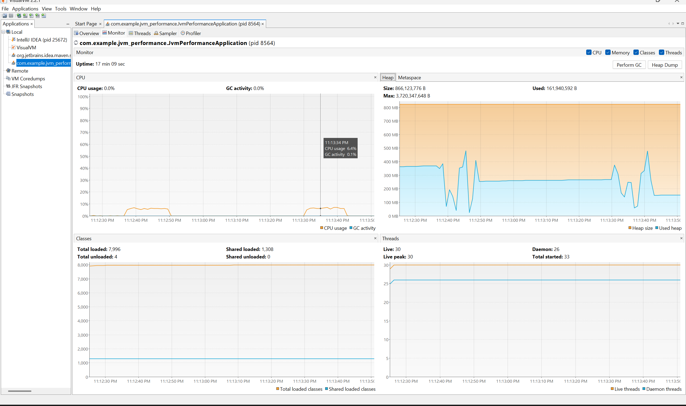
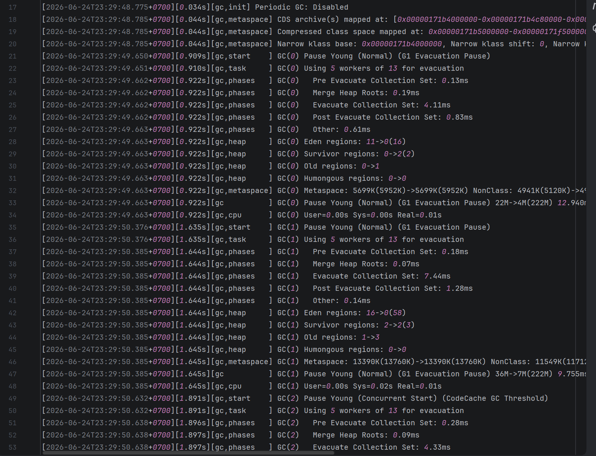

Phân tích và tối ưu hóa mã nguồn Java
## 1. Vấn đề tìm thấy
High GC Churn (Hoạt động GC cao)

Việc sử dụng phép toán += trên String trong vòng lặp tạo ra nhiều đối tượng String trung gian không cần thiết.

Memory Pressure (Áp lực bộ nhớ)

Hàng trăm nghìn đối tượng String được tạo ra và bị bỏ đi, gây áp lực lớn lên bộ nhớ Heap.

Performance Degradation (Suy giảm hiệu suất)

Thời gian xử lý tăng đáng kể do việc sao chép dữ liệu và tạo đối tượng liên tục.

Thread Blocking (Chặn luồng)

Request sẽ bị chặn cho đến khi vòng lặp hoàn thành, làm giảm khả năng đáp ứng của server.

## 2. Bằng chứng 

VisualVM - Memory Profiler:
Before loop: ~300MB 
During loop: ~500MB (tăng đột biến)
After loop: ~150MB (GC đã dọn dẹp)

Kết quả từ VisualVM cho thấy một khuôn mẫu điển hình của High Churn. 
Khi endpoint /process chạy, Heap tăng vọt.
Ngay khi GC kích hoạt, bộ nhớ lại rớt xuống, tạo ra biểu đồ hình răng cưa liên tục, đi kèm với việc CPU sử dụng cao. 
Điều này minh chứng rõ ràng cho việc hệ thống đang phải tạo ra và dọn dẹp một lượng cực lớn các đối tượng tạm trong thời gian cực ngắn.

GC Log Sample

Allocation Rate cực cao:

Mỗi chu kỳ, application tạo ra 76MB (38 regions) đối tượng

Thời gian để đạt đến ngưỡng GC: chỉ 14-18ms

Allocation rate: ~76MB / 15ms ≈ 5GB/giây !!!

Đối tượng có vòng đời ngắn:

Eden regions sau GC: 38 -> 0 (100% được dọn dẹp)

Survivor regions: chỉ tăng 2 regions (4MB)

Old regions: không thay đổi (6 regions = 12MB)

Kết luận: High GC Churn

## 3. Nguyên nhân gốc rễ

Đoạn mã gây ra vấn đề:

String result = "";
for (int i = 0; i < 150_000; i++) {
result += " " + i;
}

Phân tích

Mỗi lần thực hiện:

result += " " + i;

Trình biên dịch sẽ chuyển đổi thành dạng tương tự:

result = new StringBuilder()
.append(result)
.append(" ")
.append(i)
.toString();

Điều này dẫn đến:

Tạo một đối tượng StringBuilder mới trong mỗi lần lặp.
Sao chép toàn bộ nội dung của result hiện tại.
Tạo một đối tượng String mới chứa kết quả sau khi nối.
Đối tượng cũ nhanh chóng trở thành garbage.
Tác động:
Khoảng 150.000 đối tượng String được tạo ra.
Kích thước mỗi String tăng dần theo số lần lặp.
Phát sinh lượng lớn dữ liệu tạm thời trong Heap.
Tăng tần suất Minor GC.
Làm giảm hiệu năng tổng thể của ứng dụng.
JVM-Level Analysis
Young Generation Overflow

Số lượng lớn đối tượng sống ngắn khiến vùng Young Generation liên tục đầy và kích hoạt Minor GC.

High Allocation Rate

Tốc độ cấp phát bộ nhớ cao hơn tốc độ thu gom của Garbage Collector.

## 4. Đề xuất cách sửa lỗi
   Sử dụng StringBuilder (Khuyến nghị)
   @GetMapping("/process")
   public String processData() {
   long startTime = System.currentTimeMillis();

   StringBuilder sb = new StringBuilder(1_000_000); // Pre-allocate

   for (int i = 0; i < 150_000; i++) {
   sb.append(" ").append(i);
   }

   String result = sb.toString();

   long endTime = System.currentTimeMillis();

   return "Processing finished in "
   + (endTime - startTime)
   + "ms. Result length: "
   + result.length();
   }
   Lợi ích
   Tiêu chí	Trước tối ưu	Sau tối ưu
   Số lượng String tạo ra	~150.000	1
   GC Activity	Cao	Thấp
   Memory Usage	Tăng đột biến	Ổn định
   CPU Usage	Cao	Thấp
   Throughput	Thấp	Cao
   Kết quả mong đợi
   Giảm đáng kể số lần Minor GC.
   Giảm áp lực bộ nhớ Heap.
   Cải thiện hiệu năng xử lý.
   Giảm thời gian phản hồi request.
   Tăng khả năng chịu tải của hệ thống.
   Kết luận

Nguyên nhân chính của vấn đề là việc sử dụng phép nối chuỗi (+=) trong vòng lặp lớn, dẫn đến việc tạo ra số lượng rất lớn đối tượng String tạm thời.

Việc thay thế bằng StringBuilder giúp:

Giảm cấp phát bộ nhớ.
Giảm hoạt động của Garbage Collector.
Tăng hiệu năng xử lý.
Cải thiện khả năng mở rộng của ứng dụng.

Đây là một trong những kỹ thuật tối ưu hiệu năng cơ bản nhưng rất hiệu quả đối với các ứng dụng Java xử lý chuỗi với khối lượng lớn dữ liệu.
